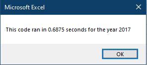
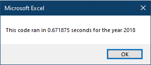
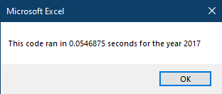

# VBA of Wall Street

## Overview of Project

The purpose of this challenge was to refactor a stock analysis macro and then measure the difference in performance. 

## Results

### Inital Performance

The original macro looped through the stock data once per ticker symbol for a total of 12 times, taking an average of 0.680 seconds to run.

```VBA
   For i = 0 To 11
       ticker = tickers(i)
       totalVolume = 0
       
       '5) loop through rows in the data
       Worksheets(yearValue).Activate
       For j = 2 To RowCount
           '5a) Get total volume for current ticker
           If Cells(j, 1).Value = ticker Then
               totalVolume = totalVolume + Cells(j, 8).Value
           End If
           '5b) get starting price for current ticker
           If ((Cells(j - 1, 1).Value <> ticker) And (Cells(j, 1).Value = ticker)) Then
              startingPrice = Cells(j, 6).Value
           End If
           '5c) get ending price for current ticker
           If ((Cells(j + 1, 1).Value <> ticker) And (Cells(j, 1).Value = ticker)) Then
               endingPrice = Cells(j, 6).Value
           End If
       Next j
       
       '6) Output data for current ticker
       Worksheets("All Stocks Analysis").Activate
       Cells(4 + i, 1).Value = ticker
       Cells(4 + i, 2).Value = totalVolume
       Cells(4 + i, 3).Value = endingPrice / startingPrice - 1
    Next i
```

 

### Refactored Performance

The refactored macro only read through the stock data once, taking an average of 0.0547 seconds to run.

```VBA
    '2b) Loop over all the rows in the spreadsheet.
    For i = 2 To RowCount
    
        '3a) Increase volume for current ticker
        tickerVolumes(tickerIndex) = tickerVolumes(tickerIndex) + Cells(i, 8).Value
        
        '3b) Check if the current row is the first row with the selected tickerIndex.
        If Cells(i - 1, 1).Value <> tickers(tickerIndex) Then
              tickerStartingPrices(tickerIndex) = Cells(i, 6).Value
        End If
     
        '3c) check if the current row is the last row with the selected ticker
         'If the next row’s ticker doesn’t match, increase the tickerIndex.
        If Cells(i + 1, 1).Value <> tickers(tickerIndex) Then
            tickerEndingPrices(tickerIndex) = Cells(i, 6).Value
            tickerIndex = tickerIndex + 1
        End If
    Next i
    
    '4) Loop through your arrays to output the Ticker, Total Daily Volume, and Return.
    For i = 0 To 11
        Worksheets("All Stocks Analysis").Activate
        Cells(4 + i, 1).Value = tickers(i)
        Cells(4 + i, 2).Value = tickerVolumes(i)
        Cells(4 + i, 3).Value = tickerEndingPrices(i) / tickerStartingPrices(i) - 1
    Next i
```

 !Refactored macro time - 2018](resources/VBA_Challenge_2018.png)

## Summary

### Advantages and Disadvantages of Refactoring

In general, refactoring code is done to improve performance, reduce resource usage, or improve readability. The disadvantage of refactoring is that it can be time consuming, and there is no guarantee that the intended benefits will materialize. Also, gains in one area might be offset by losses in another.

### Analysis of This Refactoring

The goal of this refactoring was to increase execution speed. In that regard it was a success, reducing the run time by over 12 times. As an additional benefit, the macro logic is easier to follow as there is no longer a nested for loop. As a downside, we have increased the  memory footprint of the macro by roughly 12 times, since we replaced several single variables with arrays.
